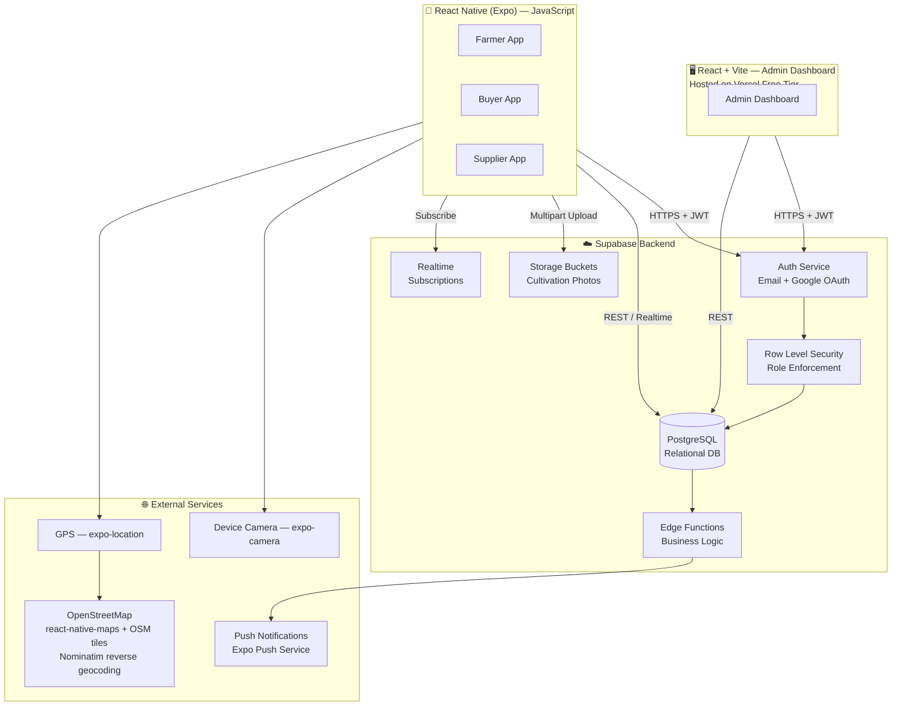
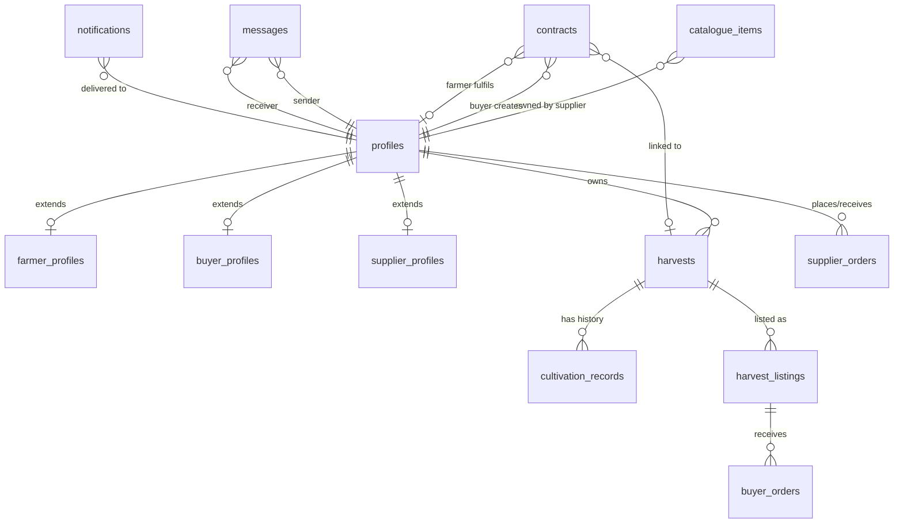
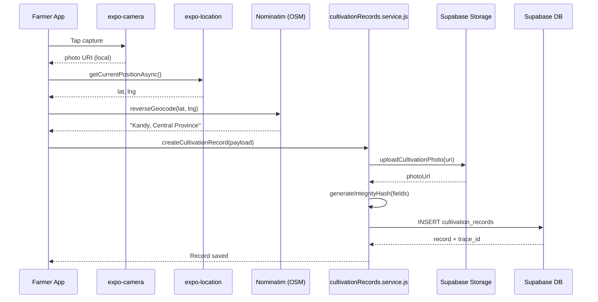
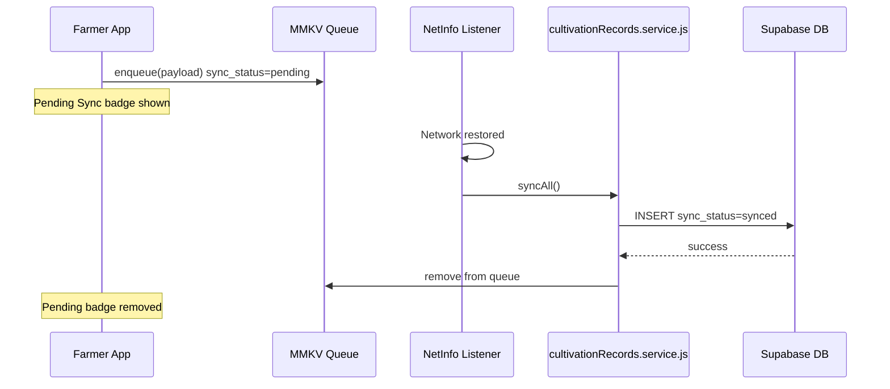
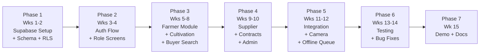

# TraceRoot — Full-Stack Architecture Plan (Final)
## React Native (Expo) + Supabase | **JavaScript**

> **Project:** Farm-to-Buyer Agricultural Contact and Transparency System
> **Group 06 · SE5104 · 2022/2023 Batch**
> **Document status:** ✅ FINAL

---

## Confirmed Decisions

| Question | Decision |
|---|---|
| **Language** | ✅ **JavaScript (ES2022+)** — no TypeScript |
| Google OAuth | ✅ Credentials available |
| Maps provider | ✅ **OpenStreetMap** (fully free, no billing required) |
| Admin hosting | ✅ **Vercel free tier** |
| Offline badge | ✅ **Show ⏳ Pending Sync** badge in cultivation timeline |

---

## 1. Backend Decision: Supabase ✅

| Feature | **Supabase** ✅ | Neon |
|---|---|---|
| Auth (Email + Google OAuth) | ✅ Built-in | ❌ Needs Clerk/Stytch |
| File / Image Storage | ✅ Built-in | ❌ Needs S3/R2 |
| Realtime Subscriptions | ✅ Built-in | ❌ Needs Pusher/Ably |
| Row Level Security (RLS) | ✅ First-class | ⚠️ Manual |
| PostgreSQL | ✅ | ✅ |
| React Native SDK | ✅ `@supabase/supabase-js` | ⚠️ DB-only |
| Free Tier | ✅ Generous | ✅ Scale-to-zero |

**Verdict:** Supabase provides Auth, Storage (cultivation photos), and Realtime (contract / messaging notifications) — all in a single SDK, with Row Level Security enforcing the 4-role permission model natively.

---

## 2. High-Level Architecture



---

## 3. Technology Stack

| Layer | Technology | Notes |
|---|---|---|
| **Mobile Framework** | Expo SDK 51 (React Native) | Managed workflow; Camera + GPS plugins built-in |
| **Language** | **JavaScript (ES2022+)** | JSDoc comments for inline documentation; no TypeScript |
| **Navigation** | Expo Router v3 (file-based) | Role-scoped layouts, deep linking |
| **State Management** | Zustand 4.x | Lightweight; minimal boilerplate |
| **Server State / Cache** | TanStack Query (React Query) 5.x | Caching, optimistic updates, offline-aware |
| **Forms** | React Hook Form | Structured cultivation forms with JS validation helpers |
| **Validation** | Plain JS validator functions | Replaces Zod; simple rule objects per form |
| **UI Styling** | NativeWind 4 (Tailwind for RN) | Matches Figma green/cream palette via utility classes |
| **Camera** | `expo-camera` | Live capture only — gallery access blocked |
| **Location / Geocoding** | `expo-location` | GPS tagging; Nominatim reverse geocoding (OSM, free) |
| **Maps** | `react-native-maps` + OpenStreetMap tiles | Fully free; no API key or billing required |
| **Offline Storage** | `react-native-mmkv` | Fast key-value store for offline record queue |
| **Backend** | Supabase (Postgres + Auth + Storage + Realtime) | Single SDK for all backend concerns |
| **Admin Dashboard** | React + Vite (JavaScript) | Deployed to Vercel free tier |
| **Notifications** | Expo Push Notification Service | Free; wraps FCM/APNs |
| **Hashing / Integrity** | `expo-crypto` (SHA-256) | Per-record tamper-detection hash |
| **Secure Token Storage** | `expo-secure-store` | Auth JWT stored in device keychain |
| **Network Detection** | `@react-native-community/netinfo` | Triggers offline queue sync on reconnect |
| **Animations** | `react-native-reanimated` | Stage timeline progress bar, transitions |

---

## 4. Supabase Database Schema (PostgreSQL)

### 4.1 Entity Relationship Overview



### 4.2 Full Table Definitions

```sql
-- ─────────────────────────────────────────────────────────────────
-- SEQUENCE for human-readable trace IDs  TR-0001, TR-0002 ...
-- ─────────────────────────────────────────────────────────────────
CREATE SEQUENCE trace_id_seq START 1;

-- ─────────────────────────────────────────────────────────────────
-- PROFILES  (extends Supabase auth.users)
-- ─────────────────────────────────────────────────────────────────
CREATE TABLE profiles (
  id           UUID PRIMARY KEY REFERENCES auth.users(id) ON DELETE CASCADE,
  role         TEXT NOT NULL CHECK (role IN ('farmer','buyer','supplier','admin')),
  full_name    TEXT NOT NULL,
  phone        TEXT,
  email        TEXT NOT NULL,
  avatar_url   TEXT,
  is_verified  BOOLEAN DEFAULT FALSE,
  created_at   TIMESTAMPTZ DEFAULT NOW()
);

-- ─────────────────────────────────────────────────────────────────
-- FARMER PROFILES
-- ─────────────────────────────────────────────────────────────────
CREATE TABLE farmer_profiles (
  id            UUID PRIMARY KEY REFERENCES profiles(id) ON DELETE CASCADE,
  farming_type  TEXT NOT NULL CHECK (farming_type IN ('greenhouse','open_field')),
  farm_name     TEXT,
  farm_location TEXT,
  farm_lat      DECIMAL(10,8),
  farm_lng      DECIMAL(11,8),
  nic_number    TEXT,
  description   TEXT
);

-- ─────────────────────────────────────────────────────────────────
-- SUPPLIER PROFILES
-- ─────────────────────────────────────────────────────────────────
CREATE TABLE supplier_profiles (
  id           UUID PRIMARY KEY REFERENCES profiles(id) ON DELETE CASCADE,
  company_name TEXT NOT NULL,
  address      TEXT,
  br_number    TEXT,
  description  TEXT
);

-- ─────────────────────────────────────────────────────────────────
-- BUYER PROFILES
-- ─────────────────────────────────────────────────────────────────
CREATE TABLE buyer_profiles (
  id            UUID PRIMARY KEY REFERENCES profiles(id) ON DELETE CASCADE,
  buyer_type    TEXT NOT NULL CHECK (buyer_type IN ('supermarket','retailer','restaurant')),
  company_name  TEXT NOT NULL,
  address       TEXT,
  br_number     TEXT
);

-- ─────────────────────────────────────────────────────────────────
-- HARVESTS  (one row = one crop cycle)
-- ─────────────────────────────────────────────────────────────────
CREATE TABLE harvests (
  id                    UUID PRIMARY KEY DEFAULT gen_random_uuid(),
  farmer_id             UUID NOT NULL REFERENCES profiles(id),
  crop_name             TEXT NOT NULL,
  crop_emoji            TEXT,
  farming_type          TEXT NOT NULL CHECK (farming_type IN ('greenhouse','open_field')),
  planted_date          DATE NOT NULL,
  expected_harvest_date DATE,
  status                TEXT NOT NULL DEFAULT 'active'
                        CHECK (status IN ('active','harvested','sold','contracted')),
  current_stage         TEXT NOT NULL DEFAULT 'seedling'
                        CHECK (current_stage IN (
                          'seedling','vegetative_growth','flowering','fruiting','harvested'
                        )),
  description           TEXT,
  cover_image_url       TEXT,
  is_listed             BOOLEAN DEFAULT FALSE,
  created_at            TIMESTAMPTZ DEFAULT NOW()
);

-- ─────────────────────────────────────────────────────────────────
-- CULTIVATION RECORDS  (APPEND-ONLY — no UPDATE/DELETE in RLS)
-- ─────────────────────────────────────────────────────────────────
CREATE TABLE cultivation_records (
  id              UUID PRIMARY KEY DEFAULT gen_random_uuid(),
  trace_id        TEXT UNIQUE NOT NULL
                  DEFAULT ('TR-' || LPAD(nextval('trace_id_seq')::TEXT, 4, '0')),
  harvest_id      UUID NOT NULL REFERENCES harvests(id),
  farmer_id       UUID NOT NULL REFERENCES profiles(id),
  stage           TEXT NOT NULL CHECK (stage IN (
                    'seedling','vegetative_growth','flowering','fruiting','harvested'
                  )),
  activity_type   TEXT NOT NULL,
  notes           TEXT,
  inputs_used     JSONB,          -- [{"name":"NPK Fertilizer","qty":"2 kg"}]
  conditions      JSONB,          -- {"temperature":"28C","humidity":"65%"}
  photo_url       TEXT,
  photo_taken_at  TIMESTAMPTZ,
  is_live_capture BOOLEAN DEFAULT TRUE,
  location_name   TEXT,
  latitude        DECIMAL(10,8),
  longitude       DECIMAL(11,8),
  sync_status     TEXT NOT NULL DEFAULT 'synced'
                  CHECK (sync_status IN ('synced','pending')),
  recorded_at     TIMESTAMPTZ NOT NULL DEFAULT NOW(),
  is_correction   BOOLEAN DEFAULT FALSE,
  corrects_id     UUID REFERENCES cultivation_records(id),
  integrity_hash  TEXT NOT NULL
);
-- No UPDATE or DELETE RLS policy is ever created on this table.

-- ─────────────────────────────────────────────────────────────────
-- SUPPLIER CATALOGUE
-- ─────────────────────────────────────────────────────────────────
CREATE TABLE catalogue_items (
  id           UUID PRIMARY KEY DEFAULT gen_random_uuid(),
  supplier_id  UUID NOT NULL REFERENCES profiles(id),
  name         TEXT NOT NULL,
  category     TEXT NOT NULL CHECK (category IN ('seed','fertilizer','pesticide','tool','other')),
  description  TEXT,
  price        DECIMAL(10,2) NOT NULL,
  unit         TEXT NOT NULL,
  stock_qty    INTEGER DEFAULT 0,
  image_url    TEXT,
  is_available BOOLEAN DEFAULT TRUE,
  created_at   TIMESTAMPTZ DEFAULT NOW()
);

-- ─────────────────────────────────────────────────────────────────
-- SUPPLIER ORDERS  (Farmer purchases from Supplier)
-- ─────────────────────────────────────────────────────────────────
CREATE TABLE supplier_orders (
  id           UUID PRIMARY KEY DEFAULT gen_random_uuid(),
  farmer_id    UUID NOT NULL REFERENCES profiles(id),
  supplier_id  UUID NOT NULL REFERENCES profiles(id),
  items        JSONB NOT NULL,
  total_amount DECIMAL(10,2) NOT NULL,
  status       TEXT NOT NULL DEFAULT 'pending'
               CHECK (status IN ('pending','confirmed','shipped','delivered','cancelled')),
  notes        TEXT,
  created_at   TIMESTAMPTZ DEFAULT NOW()
);

-- ─────────────────────────────────────────────────────────────────
-- HARVEST LISTINGS  (Farmer lists produce in marketplace)
-- ─────────────────────────────────────────────────────────────────
CREATE TABLE harvest_listings (
  id              UUID PRIMARY KEY DEFAULT gen_random_uuid(),
  harvest_id      UUID NOT NULL REFERENCES harvests(id),
  farmer_id       UUID NOT NULL REFERENCES profiles(id),
  title           TEXT NOT NULL,
  description     TEXT,
  price_per_unit  DECIMAL(10,2),
  unit            TEXT,
  available_qty   DECIMAL(10,2),
  images          JSONB,
  is_active       BOOLEAN DEFAULT TRUE,
  created_at      TIMESTAMPTZ DEFAULT NOW()
);

-- ─────────────────────────────────────────────────────────────────
-- BUYER ORDERS  (Buyer purchases from Farmer listing)
-- ─────────────────────────────────────────────────────────────────
CREATE TABLE buyer_orders (
  id          UUID PRIMARY KEY DEFAULT gen_random_uuid(),
  listing_id  UUID NOT NULL REFERENCES harvest_listings(id),
  buyer_id    UUID NOT NULL REFERENCES profiles(id),
  farmer_id   UUID NOT NULL REFERENCES profiles(id),
  quantity    DECIMAL(10,2) NOT NULL,
  total_price DECIMAL(10,2),
  status      TEXT NOT NULL DEFAULT 'pending'
              CHECK (status IN ('pending','accepted','rejected','completed','cancelled')),
  notes       TEXT,
  created_at  TIMESTAMPTZ DEFAULT NOW()
);

-- ─────────────────────────────────────────────────────────────────
-- CONTRACT FARMING
-- ─────────────────────────────────────────────────────────────────
CREATE TABLE contracts (
  id              UUID PRIMARY KEY DEFAULT gen_random_uuid(),
  buyer_id        UUID NOT NULL REFERENCES profiles(id),
  farmer_id       UUID REFERENCES profiles(id),
  crop_required   TEXT NOT NULL,
  farming_type    TEXT NOT NULL CHECK (farming_type IN ('greenhouse','open_field','any')),
  quantity        DECIMAL(10,2) NOT NULL,
  unit            TEXT NOT NULL,
  delivery_date   DATE,
  price_agreed    DECIMAL(10,2),
  requirements    TEXT,
  status          TEXT NOT NULL DEFAULT 'open'
                  CHECK (status IN (
                    'open','matched','in_progress','completed','disputed','cancelled'
                  )),
  harvest_id      UUID REFERENCES harvests(id),
  created_at      TIMESTAMPTZ DEFAULT NOW(),
  updated_at      TIMESTAMPTZ DEFAULT NOW()
);

-- ─────────────────────────────────────────────────────────────────
-- MESSAGES / NOTES
-- ─────────────────────────────────────────────────────────────────
CREATE TABLE messages (
  id          UUID PRIMARY KEY DEFAULT gen_random_uuid(),
  sender_id   UUID NOT NULL REFERENCES profiles(id),
  receiver_id UUID NOT NULL REFERENCES profiles(id),
  content     TEXT NOT NULL,
  is_read     BOOLEAN DEFAULT FALSE,
  created_at  TIMESTAMPTZ DEFAULT NOW()
);

-- ─────────────────────────────────────────────────────────────────
-- NOTIFICATIONS
-- ─────────────────────────────────────────────────────────────────
CREATE TABLE notifications (
  id         UUID PRIMARY KEY DEFAULT gen_random_uuid(),
  user_id    UUID NOT NULL REFERENCES profiles(id),
  title      TEXT NOT NULL,
  body       TEXT NOT NULL,
  type       TEXT NOT NULL CHECK (type IN ('order','contract','message','verification','sync')),
  ref_id     UUID,
  is_read    BOOLEAN DEFAULT FALSE,
  created_at TIMESTAMPTZ DEFAULT NOW()
);
```

### 4.3 Row Level Security (RLS) Policies

```sql
-- ── PROFILES ────────────────────────────────────────────────────
ALTER TABLE profiles ENABLE ROW LEVEL SECURITY;

CREATE POLICY "User sees own profile"
  ON profiles FOR SELECT USING (auth.uid() = id);

CREATE POLICY "User updates own profile"
  ON profiles FOR UPDATE USING (auth.uid() = id);

CREATE POLICY "Admin sees all profiles"
  ON profiles FOR SELECT USING (
    EXISTS (SELECT 1 FROM profiles WHERE id = auth.uid() AND role = 'admin')
  );

-- ── CULTIVATION RECORDS (APPEND-ONLY) ───────────────────────────
ALTER TABLE cultivation_records ENABLE ROW LEVEL SECURITY;

CREATE POLICY "Farmer inserts own records"
  ON cultivation_records FOR INSERT
  WITH CHECK (auth.uid() = farmer_id);

CREATE POLICY "Farmer reads own records"
  ON cultivation_records FOR SELECT
  USING (auth.uid() = farmer_id);

CREATE POLICY "Buyer reads records of listed harvests"
  ON cultivation_records FOR SELECT
  USING (
    EXISTS (
      SELECT 1 FROM harvests h
      WHERE h.id = harvest_id AND h.is_listed = TRUE
    )
  );

CREATE POLICY "Supplier reads records of supplied farmers"
  ON cultivation_records FOR SELECT
  USING (
    EXISTS (
      SELECT 1 FROM supplier_orders so
      WHERE so.farmer_id = cultivation_records.farmer_id
        AND so.supplier_id = auth.uid()
    )
  );

-- NO UPDATE POLICY  records are immutable
-- NO DELETE POLICY  records are permanent

-- ── HARVESTS ────────────────────────────────────────────────────
ALTER TABLE harvests ENABLE ROW LEVEL SECURITY;

CREATE POLICY "Farmer manages own harvests"
  ON harvests FOR ALL USING (auth.uid() = farmer_id);

CREATE POLICY "Buyer reads listed harvests"
  ON harvests FOR SELECT USING (is_listed = TRUE);

-- ── CONTRACTS ───────────────────────────────────────────────────
ALTER TABLE contracts ENABLE ROW LEVEL SECURITY;

CREATE POLICY "Buyer manages own contracts"
  ON contracts FOR ALL USING (auth.uid() = buyer_id);

CREATE POLICY "Farmer reads matched contracts"
  ON contracts FOR SELECT USING (auth.uid() = farmer_id);

CREATE POLICY "Farmer accepts contract"
  ON contracts FOR UPDATE USING (auth.uid() = farmer_id);

-- ── MESSAGES ────────────────────────────────────────────────────
ALTER TABLE messages ENABLE ROW LEVEL SECURITY;

CREATE POLICY "Parties read their own messages"
  ON messages FOR SELECT
  USING (auth.uid() = sender_id OR auth.uid() = receiver_id);

CREATE POLICY "Authenticated user sends message"
  ON messages FOR INSERT
  WITH CHECK (auth.uid() = sender_id);
```

### 4.4 Storage Bucket Layout

```
supabase/storage/
│
├── cultivation-photos/    PRIVATE (farmer owner + authorized buyers/suppliers)
│   └── {farmer_id}/
│       └── {harvest_id}/
│           └── {record_id}.jpg
│
├── harvest-images/        PUBLIC (visible in buyer marketplace)
│   └── {farmer_id}/
│       └── {harvest_id}/
│           └── {filename}.jpg
│
├── catalogue-images/      PUBLIC (supplier product photos)
│   └── {supplier_id}/
│       └── {item_id}.jpg
│
└── avatars/               PUBLIC
    └── {user_id}.jpg
```

---

## 5. React Native Project File Structure (Expo Router v3 — JavaScript)

> [!NOTE]
> All source files use `.js` and `.jsx` extensions. No `.ts` or `.tsx` files anywhere. JSDoc comments are used throughout for inline documentation instead of TypeScript interfaces.

```
TraceRoot/
│
├── app/                                  # Expo Router file-based routes
│   ├── _layout.jsx                       # Root layout: auth guard + role redirect
│   ├── index.jsx                         # Splash / redirect
│   │
│   ├── (auth)/                           # Unauthenticated screens
│   │   ├── _layout.jsx
│   │   ├── login.jsx                     # Figma Screen 1
│   │   │                                 #   4-role icon selector
│   │   │                                 #   Email + Password fields
│   │   │                                 #   Sign in with Google button
│   │   ├── register.jsx                  # Role selection step
│   │   ├── register-farmer.jsx           # Farming type, farm details
│   │   ├── register-buyer.jsx            # Buyer type, company details
│   │   ├── register-supplier.jsx         # Company name, BR number
│   │   └── forgot-password.jsx
│   │
│   ├── (farmer)/                         # Farmer role — bottom tab layout
│   │   ├── _layout.jsx                   # Tabs: Home | Harvests | Suppliers | Messages | Profile
│   │   ├── index.jsx                     # Farmer dashboard
│   │   │
│   │   ├── harvests/
│   │   │   ├── index.jsx                 # My harvests list
│   │   │   ├── new.jsx                   # Create new harvest/crop cycle
│   │   │   ├── [id].jsx                  # Figma Screen 2
│   │   │   │                             #   Crop header: Records | Photos | Days stats
│   │   │   │                             #   Stage progress dots bar
│   │   │   │                             #   Accordion per stage (Seedling / Veg / Flowering...)
│   │   │   │                             #   Record rows: TR-XXXX + photo badge + pending badge
│   │   │   └── [id]/
│   │   │       ├── record/
│   │   │       │   ├── new.jsx           # Add cultivation record
│   │   │       │   │                     #   Stage picker + Activity type picker
│   │   │       │   │                     #   Inputs used (dynamic list)
│   │   │       │   │                     #   CameraCapture (live only, no gallery)
│   │   │       │   │                     #   GPS auto-tagged location shown to user
│   │   │       │   │                     #   Submit -> enqueue if offline
│   │   │       │   └── [recordId].jsx    # Figma Screen 3
│   │   │       │                         #   Crop / Stage / Activity / Date / Time / Location
│   │   │       │                         #   INPUTS USED chips row
│   │   │       │                         #   PHOTO EVIDENCE — LIVE CAPTURE badge
│   │   │       │                         #   IntegrityBadge (shield + hash snippet)
│   │   │       └── listing.jsx           # Create/edit marketplace listing for this harvest
│   │   │
│   │   ├── contracts/
│   │   │   ├── index.jsx                 # Contracts offered to me (open / matched)
│   │   │   └── [id].jsx                  # Contract detail + accept + link harvest
│   │   │
│   │   ├── suppliers/
│   │   │   ├── index.jsx                 # Browse supplier catalogue
│   │   │   ├── [supplierId].jsx          # Supplier profile + catalogue items
│   │   │   └── orders/
│   │   │       ├── index.jsx             # My purchase orders to suppliers
│   │   │       └── [id].jsx
│   │   │
│   │   ├── messages/
│   │   │   ├── index.jsx                 # Inbox
│   │   │   └── [userId].jsx              # Chat thread
│   │   │
│   │   └── profile/
│   │       └── index.jsx
│   │
│   ├── (buyer)/                          # Buyer role — bottom tab layout
│   │   ├── _layout.jsx                   # Tabs: Home | Explore | Orders | Contracts | Profile
│   │   ├── index.jsx                     # Buyer dashboard
│   │   │
│   │   ├── explore/
│   │   │   ├── index.jsx                 # Search + filter (greenhouse / open-field)
│   │   │   └── farmer/
│   │   │       ├── [id].jsx              # Farmer public profile + active listings
│   │   │       └── [id]/
│   │   │           └── harvest/
│   │   │               └── [harvestId].jsx  # Full cultivation history (read-only)
│   │   │
│   │   ├── orders/
│   │   │   ├── index.jsx
│   │   │   └── [id].jsx
│   │   │
│   │   ├── contracts/
│   │   │   ├── index.jsx                 # My contract requests
│   │   │   ├── new.jsx                   # New contract request form
│   │   │   └── [id].jsx                  # Contract detail + status tracker
│   │   │
│   │   ├── messages/
│   │   │   ├── index.jsx
│   │   │   └── [userId].jsx
│   │   │
│   │   └── profile/
│   │       └── index.jsx
│   │
│   ├── (supplier)/                       # Supplier role — bottom tab layout
│   │   ├── _layout.jsx                   # Tabs: Home | Catalogue | Orders | Farmers | Profile
│   │   ├── index.jsx
│   │   │
│   │   ├── catalogue/
│   │   │   ├── index.jsx                 # My product listings
│   │   │   ├── new.jsx                   # Add product
│   │   │   └── [id].jsx                  # Edit product
│   │   │
│   │   ├── orders/
│   │   │   ├── index.jsx                 # Orders placed by farmers
│   │   │   └── [id].jsx
│   │   │
│   │   ├── buyback/
│   │   │   ├── index.jsx                 # Harvest buy-back management
│   │   │   └── [id].jsx
│   │   │
│   │   ├── farmers/
│   │   │   ├── index.jsx                 # Farmers I have supplied
│   │   │   └── [id]/
│   │   │       └── history.jsx           # View that farmer's cultivation history
│   │   │
│   │   └── profile/
│   │       └── index.jsx
│   │
│   └── (admin)/
│       └── index.jsx                     # Redirects to Vercel admin dashboard URL
│
├── src/
│   │
│   ├── components/
│   │   │
│   │   ├── common/
│   │   │   ├── AppButton.jsx             # Primary / secondary / ghost variants
│   │   │   ├── AppInput.jsx              # Labelled input with validation state
│   │   │   ├── AppCard.jsx               # Rounded card container
│   │   │   ├── AppBadge.jsx              # Status / label chip
│   │   │   ├── AppModal.jsx              # Bottom-sheet style modal
│   │   │   ├── LoadingSpinner.jsx
│   │   │   ├── EmptyState.jsx            # Illustration + message when list is empty
│   │   │   ├── RoleIcon.jsx              # Farmer / Buyer / Supplier / Admin icon blocks
│   │   │   └── Avatar.jsx
│   │   │
│   │   ├── auth/
│   │   │   ├── RoleSelector.jsx          # 4-icon role picker (Figma Screen 1 top row)
│   │   │   └── GoogleSignInButton.jsx    # expo-auth-session + Supabase OAuth
│   │   │
│   │   ├── harvest/
│   │   │   ├── HarvestCard.jsx           # Card in "my harvests" list
│   │   │   ├── HarvestStats.jsx          # Records | With Photo | Days Grown row
│   │   │   ├── GrowthStageTimeline.jsx   # Stage progress dots + accordion list
│   │   │   ├── StageProgressBar.jsx      # Horizontal dots: completed/current/future
│   │   │   ├── StageItem.jsx             # Accordion row for one stage
│   │   │   └── CultivationRecordRow.jsx  # TR-XXXX row + photo badge + pending badge
│   │   │
│   │   ├── cultivation/
│   │   │   ├── RecordDetailCard.jsx      # Crop/Stage/Activity/Date/Time/Location grid
│   │   │   ├── InputsUsedChips.jsx       # "NPK Fertilizer — 2 kg" pill chips
│   │   │   ├── PhotoEvidence.jsx         # LIVE CAPTURE badge + full-width photo
│   │   │   ├── IntegrityBadge.jsx        # Shield icon + hash snippet (verified)
│   │   │   ├── PendingSyncBadge.jsx      # Pending Sync badge for offline records
│   │   │   └── CameraCapture.jsx         # In-app live camera — no gallery access
│   │   │
│   │   ├── marketplace/
│   │   │   ├── FarmerCard.jsx            # Farmer card in buyer explore list
│   │   │   ├── HarvestListingCard.jsx    # Harvest listing with price + qty
│   │   │   ├── CatalogueItemCard.jsx     # Supplier product card
│   │   │   └── FilterBar.jsx             # Greenhouse / Open-field toggle
│   │   │
│   │   ├── contract/
│   │   │   ├── ContractCard.jsx
│   │   │   ├── ContractStatusBadge.jsx
│   │   │   └── ContractProgressTracker.jsx
│   │   │
│   │   ├── map/
│   │   │   └── FarmLocationMap.jsx       # react-native-maps + OSM tiles (free)
│   │   │
│   │   └── messaging/
│   │       ├── MessageBubble.jsx
│   │       └── NoteComposer.jsx
│   │
│   ├── hooks/
│   │   ├── useAuth.js                    # Session, user, role from Supabase
│   │   ├── useHarvests.js
│   │   ├── useCultivationRecords.js
│   │   ├── useContracts.js
│   │   ├── useMessages.js                # Realtime subscription for chat
│   │   ├── useSupplierCatalogue.js
│   │   ├── useOrders.js
│   │   ├── useLocation.js                # expo-location wrapper + permission request
│   │   ├── useCamera.js                  # expo-camera wrapper, returns photo URI
│   │   ├── useReverseGeocode.js          # coords -> "City, Region" via Nominatim (OSM)
│   │   ├── useImageUpload.js             # Supabase Storage multipart upload helper
│   │   ├── useOfflineQueue.js            # MMKV queue + NetInfo auto-sync trigger
│   │   └── useNotifications.js           # Expo push token registration + listener
│   │
│   ├── lib/
│   │   ├── supabase.js                   # Supabase client (SecureStore adapter)
│   │   ├── integrity.js                  # SHA-256 hash via expo-crypto
│   │   ├── queryClient.js                # TanStack Query client config
│   │   ├── mmkv.js                       # MMKV singleton instance
│   │   └── theme.js                      # Design tokens (colors, typography, spacing)
│   │
│   ├── services/
│   │   ├── auth.service.js               # signIn, signUp, signOut, Google OAuth
│   │   ├── profiles.service.js           # getProfile, updateProfile, verifyUser
│   │   ├── harvests.service.js           # createHarvest, updateStage, listPublic
│   │   ├── cultivationRecords.service.js # createRecord (INSERT-only) + getHistory
│   │   ├── catalogue.service.js          # CRUD for catalogue_items
│   │   ├── orders.service.js             # createSupplierOrder, createBuyerOrder
│   │   ├── contracts.service.js          # createContract, matchFarmer, updateStatus
│   │   ├── messages.service.js           # sendMessage, getThread, markRead
│   │   ├── storage.service.js            # uploadPhoto, getSignedUrl
│   │   └── notifications.service.js      # registerToken, markRead, getAll
│   │
│   ├── store/
│   │   ├── authStore.js                  # { user, session, role, setSession }
│   │   ├── offlineQueueStore.js          # { queue, enqueue, dequeue, pendingCount }
│   │   └── uiStore.js                    # { toast, loading, modals }
│   │
│   ├── constants/
│   │   ├── stages.js                     # STAGES array (seedling to harvested)
│   │   ├── roles.js                      # ROLES array + ROLE_ROUTES map
│   │   ├── activityTypes.js              # Activity type options per stage
│   │   └── inputCategories.js            # Input categories for cultivation forms
│   │
│   └── utils/
│       ├── dateFormat.js                 # formatDate(), formatTime()
│       ├── traceId.js                    # formatTraceId(n) -> "TR-0047"
│       ├── stageHelpers.js               # stageIndex(), stageColor(), stageIcon()
│       └── validators.js                 # Plain JS validation rule functions
│
├── supabase/
│   ├── config.toml
│   ├── migrations/
│   │   ├── 001_initial_schema.sql
│   │   ├── 002_rls_policies.sql
│   │   ├── 003_storage_buckets.sql
│   │   └── 004_seed_data.sql
│   └── functions/
│       ├── send-notification/
│       │   └── index.js                  # Deno Edge Function
│       ├── verify-live-capture/
│       │   └── index.js
│       └── sync-offline-records/
│           └── index.js
│
├── admin-dashboard/                      # Separate Vite + React JS app -> Vercel
│   ├── src/
│   │   ├── pages/
│   │   │   ├── Dashboard.jsx             # Summary metrics
│   │   │   ├── Users.jsx                 # Verify / reject / suspend registrations
│   │   │   ├── Farmers.jsx
│   │   │   ├── Contracts.jsx
│   │   │   └── Reports.jsx
│   │   ├── components/
│   │   │   ├── UserRow.jsx
│   │   │   ├── VerifyButton.jsx
│   │   │   └── DataTable.jsx
│   │   └── lib/
│   │       └── supabase.js               # service_role key (admin only)
│   ├── vercel.json
│   ├── package.json
│   └── vite.config.js
│
├── assets/
│   ├── images/
│   │   ├── splash.png
│   │   ├── icon.png
│   │   └── adaptive-icon.png
│   └── fonts/
│       └── Inter/                        # Inter Regular, SemiBold, Bold
│
├── app.json                              # Expo config (bundleId, permissions)
├── babel.config.js
├── tailwind.config.js                    # NativeWind + custom TraceRoot colors
├── jsconfig.json                         # JS path aliases (@/ -> src/)
├── .env                                  # EXPO_PUBLIC_SUPABASE_URL + ANON_KEY
├── .env.local                            # SERVICE_ROLE_KEY (never commit)
└── package.json
```

---

## 6. Key Implementation Reference (JavaScript)

### 6.1 `jsconfig.json` (Path Aliases — replaces tsconfig)

```json
{
  "compilerOptions": {
    "baseUrl": ".",
    "paths": {
      "@/*": ["src/*"]
    },
    "jsx": "react-native"
  },
  "include": ["**/*.js", "**/*.jsx"]
}
```

### 6.2 Supabase Client

```javascript
// src/lib/supabase.js
import { createClient } from '@supabase/supabase-js';
import * as SecureStore from 'expo-secure-store';

/**
 * Adapter so Supabase stores auth tokens in the device keychain
 * instead of AsyncStorage (which is unencrypted).
 */
const ExpoSecureStoreAdapter = {
  getItem:    (key) => SecureStore.getItemAsync(key),
  setItem:    (key, value) => SecureStore.setItemAsync(key, value),
  removeItem: (key) => SecureStore.deleteItemAsync(key),
};

export const supabase = createClient(
  process.env.EXPO_PUBLIC_SUPABASE_URL,
  process.env.EXPO_PUBLIC_SUPABASE_ANON_KEY,
  {
    auth: {
      storage: ExpoSecureStoreAdapter,
      autoRefreshToken: true,
      persistSession: true,
      detectSessionInUrl: false,   // required for React Native
    },
  }
);
```

### 6.3 Cultivation Record Service (Append-Only + Integrity Hash)

```javascript
// src/services/cultivationRecords.service.js
import { supabase } from '@/lib/supabase';
import { generateIntegrityHash } from '@/lib/integrity';
import { uploadCultivationPhoto } from './storage.service';

/**
 * Creates a new cultivation record.
 * This function ONLY ever calls INSERT — no UPDATE or DELETE is ever used.
 *
 * @param {{
 *   harvestId: string,
 *   stage: string,
 *   activityType: string,
 *   notes?: string,
 *   inputsUsed?: Array<{name: string, qty: string}>,
 *   conditions?: object,
 *   photoUri: string,
 *   latitude: number,
 *   longitude: number,
 *   locationName: string,
 *   isCorrection?: boolean,
 *   correctsId?: string,
 *   syncStatus?: 'synced'|'pending'
 * }} payload
 */
export async function createCultivationRecord(payload) {
  const { data: { user } } = await supabase.auth.getUser();
  if (!user) throw new Error('Not authenticated');

  // 1. Upload live photo to Supabase Storage
  const photoUrl = await uploadCultivationPhoto(
    payload.photoUri, user.id, payload.harvestId
  );

  // 2. Generate SHA-256 tamper-detection hash
  const integrityHash = await generateIntegrityHash({
    harvestId:    payload.harvestId,
    farmerId:     user.id,
    stage:        payload.stage,
    activityType: payload.activityType,
    photoUrl,
    latitude:     payload.latitude,
    longitude:    payload.longitude,
    recordedAt:   new Date().toISOString(),
  });

  // 3. INSERT — no update/delete is ever issued from this service
  const { data, error } = await supabase
    .from('cultivation_records')
    .insert({
      harvest_id:      payload.harvestId,
      farmer_id:       user.id,
      stage:           payload.stage,
      activity_type:   payload.activityType,
      notes:           payload.notes ?? null,
      inputs_used:     payload.inputsUsed ?? null,
      conditions:      payload.conditions ?? null,
      photo_url:       photoUrl,
      photo_taken_at:  new Date().toISOString(),
      is_live_capture: true,
      latitude:        payload.latitude,
      longitude:       payload.longitude,
      location_name:   payload.locationName,
      sync_status:     payload.syncStatus ?? 'synced',
      is_correction:   payload.isCorrection ?? false,
      corrects_id:     payload.correctsId ?? null,
      integrity_hash:  integrityHash,
    })
    .select()
    .single();

  if (error) throw error;
  return data;
}

/**
 * Returns full cultivation history for a harvest.
 * Used by farmers (own), buyers (listed), and suppliers (supplied).
 *
 * @param {string} harvestId
 */
export async function getCultivationHistory(harvestId) {
  const { data, error } = await supabase
    .from('cultivation_records')
    .select('*')
    .eq('harvest_id', harvestId)
    .order('recorded_at', { ascending: true });

  if (error) throw error;
  return data;
}
```

### 6.4 Integrity Hash (SHA-256 via expo-crypto)

```javascript
// src/lib/integrity.js
import * as Crypto from 'expo-crypto';

/**
 * Generates a SHA-256 integrity hash for a cultivation record.
 * Keys are sorted so the same input always produces the same hash.
 *
 * @param {object} input
 * @returns {Promise<string>} hex hash string
 */
export async function generateIntegrityHash(input) {
  const sortedPayload = JSON.stringify(input, Object.keys(input).sort());
  return await Crypto.digestStringAsync(
    Crypto.CryptoDigestAlgorithm.SHA256,
    sortedPayload
  );
}
```

### 6.5 Live Camera (Gallery Intentionally Blocked)

```javascript
// src/components/cultivation/CameraCapture.jsx
import { CameraView, useCameraPermissions } from 'expo-camera';
import * as Location from 'expo-location';
import { useRef } from 'react';
import { View, Text, TouchableOpacity, StyleSheet } from 'react-native';

/**
 * In-app live camera capture.
 * Gallery access is intentionally NOT provided.
 * Every cultivation photo must be captured live with GPS auto-tagged.
 *
 * @param {{ onCapture: (uri: string, location: object) => void }} props
 */
export function CameraCapture({ onCapture }) {
  const [permission, requestPermission] = useCameraPermissions();
  const cameraRef = useRef(null);

  const takePicture = async () => {
    if (!cameraRef.current) return;

    // Live capture only — ImagePicker is never used in this component
    const photo = await cameraRef.current.takePictureAsync({ quality: 0.8 });

    const loc = await Location.getCurrentPositionAsync({
      accuracy: Location.Accuracy.High,
    });
    const [address] = await Location.reverseGeocodeAsync({
      latitude: loc.coords.latitude,
      longitude: loc.coords.longitude,
    });

    onCapture(photo.uri, {
      lat:  loc.coords.latitude,
      lng:  loc.coords.longitude,
      name: `${address.city ?? address.town ?? ''}, ${address.region ?? ''}`.trim(),
    });
  };

  if (!permission?.granted) {
    return (
      <View style={styles.permissionBox}>
        <Text style={styles.permissionText}>
          Camera permission required for live cultivation capture
        </Text>
        <TouchableOpacity onPress={requestPermission} style={styles.grantBtn}>
          <Text style={styles.grantText}>Grant Permission</Text>
        </TouchableOpacity>
      </View>
    );
  }

  return (
    <CameraView ref={cameraRef} style={{ flex: 1 }} facing="back">
      <View style={styles.liveBadge}>
        <View style={styles.greenDot} />
        <Text style={styles.liveText}>LIVE CAPTURE</Text>
      </View>
      <TouchableOpacity onPress={takePicture} style={styles.captureBtn}>
        <View style={styles.captureInner} />
      </TouchableOpacity>
    </CameraView>
  );
}

const styles = StyleSheet.create({
  permissionBox:  { flex: 1, justifyContent: 'center', alignItems: 'center', padding: 24 },
  permissionText: { textAlign: 'center', marginBottom: 16, color: '#6B6B6B' },
  grantBtn:       { backgroundColor: '#2D6A4F', padding: 12, borderRadius: 8 },
  grantText:      { color: '#fff', fontWeight: '600' },
  liveBadge:      { position: 'absolute', top: 16, left: 16, flexDirection: 'row',
                    alignItems: 'center', backgroundColor: 'rgba(0,0,0,0.55)',
                    borderRadius: 8, paddingHorizontal: 10, paddingVertical: 5, gap: 6 },
  greenDot:       { width: 8, height: 8, borderRadius: 4, backgroundColor: '#74C69D' },
  liveText:       { color: '#fff', fontSize: 12, fontWeight: '700', letterSpacing: 1 },
  captureBtn:     { position: 'absolute', bottom: 40, alignSelf: 'center',
                    width: 72, height: 72, borderRadius: 36,
                    backgroundColor: 'rgba(255,255,255,0.3)',
                    justifyContent: 'center', alignItems: 'center' },
  captureInner:   { width: 56, height: 56, borderRadius: 28, backgroundColor: '#fff' },
});
```

### 6.6 OpenStreetMap via react-native-maps (Free, No API Key)

```javascript
// src/components/map/FarmLocationMap.jsx
import MapView, { Marker, UrlTile } from 'react-native-maps';

/**
 * Displays farm location using OpenStreetMap tiles.
 * No Google Maps SDK or billing account required.
 *
 * @param {{ latitude: number, longitude: number, locationName: string }} props
 */
export function FarmLocationMap({ latitude, longitude, locationName }) {
  return (
    <MapView
      style={{ height: 200, borderRadius: 12 }}
      initialRegion={{
        latitude,
        longitude,
        latitudeDelta:  0.01,
        longitudeDelta: 0.01,
      }}
      mapType="none"   // disable default Google/Apple base tiles
    >
      {/* OpenStreetMap tile layer — fully free */}
      <UrlTile
        urlTemplate="https://tile.openstreetmap.org/{z}/{x}/{y}.png"
        maximumZ={19}
        flipY={false}
      />
      <Marker coordinate={{ latitude, longitude }} title={locationName} />
    </MapView>
  );
}
```

### 6.7 Nominatim Reverse Geocoding (OSM — Free)

```javascript
// src/hooks/useReverseGeocode.js

/**
 * Converts GPS coordinates to a human-readable location name
 * using OSM Nominatim (free, no API key).
 * A User-Agent header is required by the Nominatim terms of service.
 *
 * @param {number} lat
 * @param {number} lng
 * @returns {Promise<string>}  e.g. "Kandy, Central Province"
 */
export async function reverseGeocode(lat, lng) {
  const res = await fetch(
    `https://nominatim.openstreetmap.org/reverse?format=json&lat=${lat}&lon=${lng}`,
    { headers: { 'User-Agent': 'TraceRoot/1.0 (traceroot@group06.ac.lk)' } }
  );
  const data = await res.json();
  const { city, town, village, state } = data.address ?? {};
  const place = city ?? town ?? village ?? '';
  return `${place}, ${state ?? ''}`.trim().replace(/^,\s*/, '');
}
```

### 6.8 Offline Queue + ⏳ Pending Sync Badge

```javascript
// src/hooks/useOfflineQueue.js
import { useState, useEffect } from 'react';
import { MMKV } from 'react-native-mmkv';
import NetInfo from '@react-native-community/netinfo';
import { createCultivationRecord } from '@/services/cultivationRecords.service';

const storage = new MMKV();
const QUEUE_KEY = 'offline_cultivation_queue';

function loadQueue() {
  const raw = storage.getString(QUEUE_KEY);
  return raw ? JSON.parse(raw) : [];
}

function persistQueue(queue) {
  storage.set(QUEUE_KEY, JSON.stringify(queue));
}

/**
 * Manages offline cultivation records queued when no connectivity.
 * Records show a Pending Sync badge until successfully synced.
 */
export function useOfflineQueue() {
  const [queue, setQueue] = useState(loadQueue);

  const enqueue = (payload) => {
    const item = {
      id:       Date.now().toString(36),
      payload:  { ...payload, syncStatus: 'pending' },
      queuedAt: new Date().toISOString(),
    };
    const updated = [...queue, item];
    persistQueue(updated);
    setQueue(updated);
  };

  const syncAll = async () => {
    if (queue.length === 0) return;
    const failed = [];
    for (const item of queue) {
      try {
        await createCultivationRecord({ ...item.payload, syncStatus: 'synced' });
      } catch {
        failed.push(item);
      }
    }
    persistQueue(failed);
    setQueue(failed);
  };

  // Auto-sync when network is restored
  useEffect(() => {
    const unsubscribe = NetInfo.addEventListener((state) => {
      if (state.isConnected) syncAll();
    });
    return unsubscribe;
  }, [queue]);

  return { queue, enqueue, syncAll, pendingCount: queue.length };
}
```

```javascript
// src/components/cultivation/PendingSyncBadge.jsx
import { View, Text, StyleSheet } from 'react-native';

export function PendingSyncBadge() {
  return (
    <View style={styles.badge}>
      <Text style={styles.icon}>⏳</Text>
      <Text style={styles.label}>Pending Sync</Text>
    </View>
  );
}

const styles = StyleSheet.create({
  badge: {
    flexDirection: 'row', alignItems: 'center',
    backgroundColor: '#FFF3CD', borderRadius: 8,
    paddingHorizontal: 8, paddingVertical: 3, gap: 4,
  },
  icon:  { fontSize: 11 },
  label: { fontSize: 11, color: '#856404', fontWeight: '600' },
});
```

### 6.9 Google OAuth

```javascript
// src/services/auth.service.js
import * as WebBrowser from 'expo-web-browser';
import * as AuthSession from 'expo-auth-session';
import { supabase } from '@/lib/supabase';

WebBrowser.maybeCompleteAuthSession();

export async function signInWithGoogle() {
  const redirectUrl = AuthSession.makeRedirectUri({ scheme: 'traceroot' });

  const { data, error } = await supabase.auth.signInWithOAuth({
    provider: 'google',
    options: { redirectTo: redirectUrl, skipBrowserRedirect: true },
  });

  if (error || !data.url) throw error ?? new Error('No OAuth URL');

  const result = await WebBrowser.openAuthSessionAsync(data.url, redirectUrl);

  if (result.type === 'success' && result.url) {
    const params = new URLSearchParams(result.url.split('#')[1]);
    await supabase.auth.setSession({
      access_token:  params.get('access_token'),
      refresh_token: params.get('refresh_token'),
    });
  }
}

export async function signInWithEmail(email, password) {
  const { data, error } = await supabase.auth.signInWithPassword({ email, password });
  if (error) throw error;
  return data;
}

export async function signOut() {
  const { error } = await supabase.auth.signOut();
  if (error) throw error;
}
```

### 6.10 Role-Based Navigation

```javascript
// app/_layout.jsx
import { Redirect } from 'expo-router';
import { useAuth } from '@/hooks/useAuth';

const ROLE_ROUTES = {
  farmer:   '/(farmer)',
  buyer:    '/(buyer)',
  supplier: '/(supplier)',
  admin:    '/(admin)',
};

export default function RootLayout() {
  const { session, role, loading } = useAuth();

  if (loading) return null;
  if (!session) return <Redirect href="/(auth)/login" />;

  return <Redirect href={ROLE_ROUTES[role] ?? '/(auth)/login'} />;
}
```

### 6.11 Constants (replaces TypeScript enums)

```javascript
// src/constants/stages.js
export const STAGES = [
  { key: 'seedling',          label: 'Seedling',          icon: '🌱', color: '#74C69D' },
  { key: 'vegetative_growth', label: 'Vegetative Growth', icon: '🌿', color: '#74C69D' },
  { key: 'flowering',         label: 'Flowering',         icon: '🌸', color: '#E76F51' },
  { key: 'fruiting',          label: 'Fruiting',          icon: '🍅', color: '#74C69D' },
  { key: 'harvested',         label: 'Harvested',         icon: '📦', color: '#74C69D' },
];

// src/constants/roles.js
export const ROLE_ROUTES = {
  farmer:   '/(farmer)',
  buyer:    '/(buyer)',
  supplier: '/(supplier)',
  admin:    '/(admin)',
};

// src/constants/activityTypes.js
export const ACTIVITY_TYPES = {
  seedling:          ['Seed Sowing', 'Germination Check', 'Seedling Observation'],
  vegetative_growth: ['Growth Observation', 'Fertilizer Applied', 'Pesticide Applied', 'Irrigation'],
  flowering:         ['Flowering Observation', 'Fertilizer Applied', 'Pest Control'],
  fruiting:          ['Fruit Development Check', 'Fertilizer Applied', 'Harvest Preparation'],
  harvested:         ['Harvest Completed', 'Post-Harvest Handling'],
};
```

### 6.12 Plain JS Validators (replaces Zod)

```javascript
// src/utils/validators.js

/**
 * Validates a cultivation record form.
 * @param {object} values
 * @returns {{ valid: boolean, errors: object }}
 */
export function validateCultivationRecord(values) {
  const errors = {};
  if (!values.stage)        errors.stage        = 'Stage is required';
  if (!values.activityType) errors.activityType = 'Activity type is required';
  if (!values.photoUri)     errors.photoUri     = 'A live photo is required';
  if (values.latitude == null || values.longitude == null)
                            errors.location     = 'Location could not be determined';
  return { valid: Object.keys(errors).length === 0, errors };
}

/**
 * Validates a user registration form.
 * @param {object} values
 * @returns {{ valid: boolean, errors: object }}
 */
export function validateRegistration(values) {
  const errors = {};
  if (!values.fullName?.trim())
    errors.fullName = 'Full name is required';
  if (!values.email?.match(/^[^\s@]+@[^\s@]+\.[^\s@]+$/))
    errors.email = 'Enter a valid email address';
  if (!values.password || values.password.length < 8)
    errors.password = 'Password must be at least 8 characters';
  if (!values.role)
    errors.role = 'Please select your role';
  return { valid: Object.keys(errors).length === 0, errors };
}
```

---

## 7. Design System Tokens (Matching Figma)

```javascript
// src/lib/theme.js
export const colors = {
  primary:      '#2D6A4F',   // Deep forest green
  primaryLight: '#74C69D',   // Light green — completed stages
  accent:       '#E76F51',   // Warm orange — current stage / NOW badge
  background:   '#F8F5F0',   // Warm cream — main background
  surface:      '#FFFFFF',
  border:       '#E8E0D5',
  text: {
    primary:   '#1B1B1B',
    secondary: '#6B6B6B',
    muted:     '#AAAAAA',
    inverse:   '#FFFFFF',
  },
  status: {
    verified:  '#2D6A4F',
    pending:   '#856404',
    pendingBg: '#FFF3CD',    // Pending sync badge background
    danger:    '#E63946',
    info:      '#4361EE',
  },
};

export const typography = {
  heading1:   { fontFamily: 'Inter-Bold',     fontSize: 28, lineHeight: 34 },
  heading2:   { fontFamily: 'Inter-Bold',     fontSize: 22, lineHeight: 28 },
  subheading: { fontFamily: 'Inter-SemiBold', fontSize: 16, lineHeight: 22 },
  body:       { fontFamily: 'Inter-Regular',  fontSize: 14, lineHeight: 20 },
  caption:    { fontFamily: 'Inter-Regular',  fontSize: 12, lineHeight: 16 },
  label:      { fontFamily: 'Inter-SemiBold', fontSize: 12, lineHeight: 16 },
};

export const spacing = { xs: 4, sm: 8, md: 16, lg: 24, xl: 32, xxl: 48 };
export const radius  = { sm: 8, md: 12, lg: 16, full: 9999 };
```

---

## 8. NPM Package Manifest

```json
{
  "name": "traceroot",
  "version": "1.0.0",
  "main": "expo-router/entry",
  "dependencies": {
    "expo":                              "~51.0.28",
    "expo-router":                       "~3.5.23",
    "expo-camera":                       "~15.0.16",
    "expo-location":                     "~17.0.1",
    "expo-crypto":                       "~13.0.2",
    "expo-secure-store":                 "~13.0.2",
    "expo-notifications":                "~0.28.19",
    "expo-web-browser":                  "~13.0.3",
    "expo-auth-session":                 "~5.5.2",
    "expo-image":                        "~1.12.15",
    "@supabase/supabase-js":             "^2.43.5",
    "@tanstack/react-query":             "^5.51.23",
    "react-hook-form":                   "^7.52.2",
    "zustand":                           "^4.5.4",
    "nativewind":                        "^4.0.36",
    "react-native-mmkv":                 "^2.12.2",
    "react-native-maps":                 "1.14.0",
    "@react-native-community/netinfo":   "^11.3.2",
    "date-fns":                          "^3.6.0",
    "react-native-reanimated":           "~3.10.1",
    "react-native-gesture-handler":      "~2.16.2",
    "react-native-safe-area-context":    "4.10.5",
    "react-native-screens":              "3.31.1",
    "react":                             "18.2.0",
    "react-native":                      "0.74.5"
  },
  "devDependencies": {
    "babel-plugin-module-resolver":      "^5.0.2",
    "tailwindcss":                       "^3.4.7",
    "supabase":                          "^1.191.3"
  }
}
```

> [!NOTE]
> No `typescript`, `@types/*` packages anywhere. The project runs entirely in JavaScript.

---

## 9. Admin Dashboard — Vercel Deployment

```javascript
// admin-dashboard/vite.config.js
import { defineConfig } from 'vite';
import react from '@vitejs/plugin-react';
export default defineConfig({ plugins: [react()] });
```

```json
// admin-dashboard/vercel.json
{
  "rewrites": [{ "source": "/(.*)", "destination": "/index.html" }]
}
```

> [!CAUTION]
> The **service_role** Supabase key bypasses all RLS. It must **never** be committed to the repository or included in the mobile app. Store it only in Vercel's environment variable settings.

**Deployment Steps:**
1. `npm create vite@latest admin-dashboard -- --template react`
2. Push `admin-dashboard/` to the same GitHub repo
3. Connect to Vercel → set root directory to `admin-dashboard/`
4. Add env vars: `VITE_SUPABASE_URL` and `VITE_SUPABASE_SERVICE_ROLE_KEY`
5. Deploy → free `.vercel.app` URL

---

## 10. Security & Data Integrity Summary

| Mechanism | How It Works |
|---|---|
| **Append-only records** | No RLS UPDATE or DELETE policy on `cultivation_records` — immutable forever |
| **SHA-256 integrity hash** | Generated from sorted JSON of key fields; stored per record for tamper detection |
| **Live capture enforced** | `CameraCapture.jsx` uses `expo-camera` only; `ImagePicker` never used for cultivation evidence |
| **GPS auto-tag** | `expo-location` fires on every capture; Nominatim (OSM) reverse geocodes to address |
| **Correction chain** | Farmer submits a new record with `is_correction=true` + `corrects_id`; original stays visible |
| **Role enforcement** | RLS policies on every table; each role sees/does only what is explicitly allowed |
| **JWT auth** | Supabase short-lived JWTs; `expo-secure-store` (device keychain) persists them safely |
| **HTTPS everywhere** | Supabase, Nominatim, and Vercel are all TLS encrypted |
| **Admin isolation** | `service_role` key only in Vercel env vars; mobile `anon` key cannot bypass RLS |
| **Pending sync badge** | Offline records visually flagged in timeline until confirmed synced to Supabase |

---

## 11. Data Flow Diagrams

### Online Submission



### Offline Queue and Sync



---

## 12. Development Phases



| Sprint | Key Deliverables | Owner |
|---|---|---|
| **1** | Supabase project, SQL migrations, RLS, Storage buckets | All |
| **2** | Auth screens: login, 4-role selector, 3 registration forms, Google OAuth | 22CSE0397 |
| **3** | Farmer dashboard, harvest CRUD, GrowthStageTimeline (Figma Screen 2) | 22CSE0377 |
| **4** | Live camera + GPS + Nominatim + Supabase Storage upload (Figma Screen 3) | 22CSE0377 |
| **5** | Buyer explore/search/filter + cultivation history read-only view | 22CSE0365 |
| **6** | Supplier catalogue + farmer-supplier order flow + buyback | 22CSE0365 |
| **7** | Contract farming module (create, match, track, link harvest) | 22CSE0384 |
| **8** | Admin web dashboard (Vite + React JS) deployed to Vercel | 22CSE0397 |
| **9** | Offline queue (Pending badge) + Realtime messaging + push notifications | All |
| **10** | Unit tests, integration tests, usability testing, bug fixes, demo prep | All |

---

## 13. Module-to-File Ownership

| Member | Module | Primary Files |
|---|---|---|
| **22CSE0377** | Farmer + Cultivation History | `app/(farmer)/harvests/`, `src/components/harvest/`, `src/components/cultivation/`, `src/services/cultivationRecords.service.js`, `src/hooks/useCamera.js`, `src/hooks/useOfflineQueue.js` |
| **22CSE0365** | Buyer + Supplier | `app/(buyer)/explore/`, `app/(supplier)/`, `src/components/marketplace/`, `src/services/orders.service.js`, `src/components/messaging/`, `src/hooks/useMessages.js` |
| **22CSE0384** | Contract Farming + Farmer | `app/(buyer)/contracts/`, `app/(farmer)/contracts/`, `src/components/contract/`, `src/services/contracts.service.js` |
| **22CSE0397** | Admin + Buyer UI + Auth | `admin-dashboard/`, `app/(auth)/`, `app/(buyer)/`, `src/services/auth.service.js`, `src/services/notifications.service.js` |

---

## 14. Environment Variables

```bash
# .env  (committed — safe public values)
EXPO_PUBLIC_SUPABASE_URL=https://your-project.supabase.co
EXPO_PUBLIC_SUPABASE_ANON_KEY=eyJhbGci...

# .env.local  (NEVER commit — add to .gitignore)
SUPABASE_SERVICE_ROLE_KEY=eyJhbGci...

# Vercel dashboard env vars (admin-dashboard only)
VITE_SUPABASE_URL=https://your-project.supabase.co
VITE_SUPABASE_SERVICE_ROLE_KEY=eyJhbGci...
```
