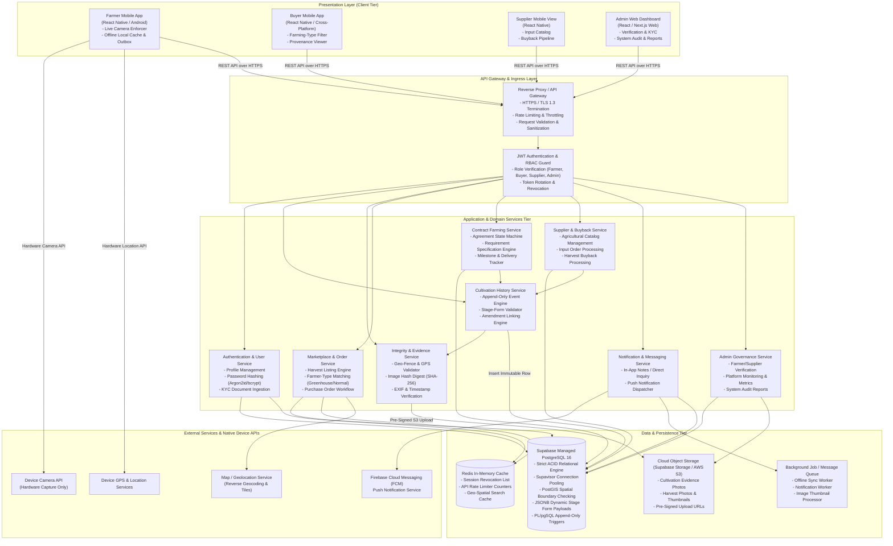
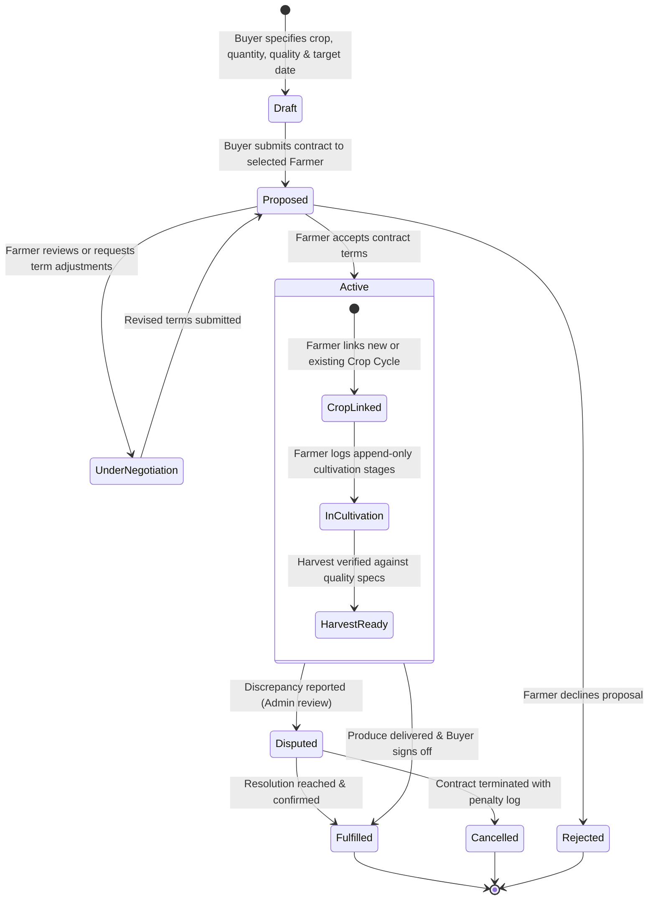
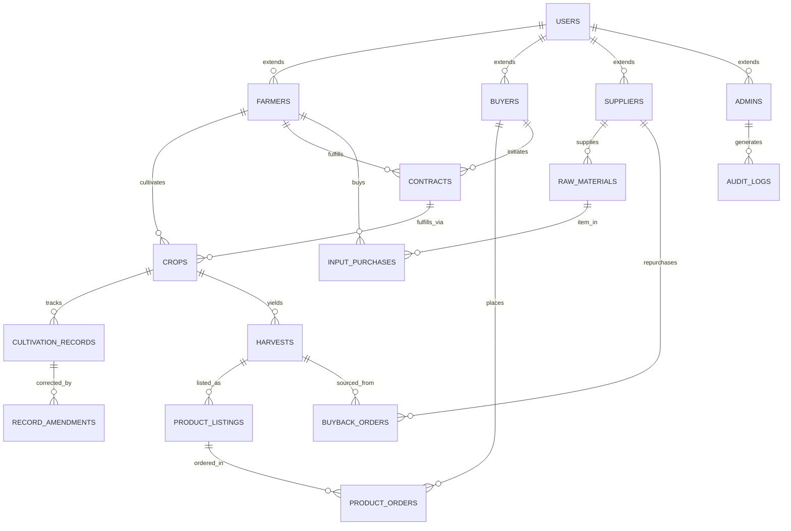

# System Architecture - TraceRoot
## Farm-to-Buyer Agricultural Contact and Transparency System

---

## 1. Overview

**TraceRoot** is a digital platform designed to bridge information asymmetry in agricultural supply chains. Built specifically to empower small- and medium-scale farmers, transparent agricultural suppliers, and institutional produce buyers (supermarkets, restaurants, and retailers), TraceRoot introduces end-to-end provenance tracking through an **append-only "Cultivation History" ledger** and direct **Contract Farming** workflows.

### 1.1 Architectural Vision & Paradigm

TraceRoot adopts a **Modular Layered Architecture** (Clean Architecture principles) with an **Offline-First Edge Strategy**. Given the rural deployment context with intermittent cellular connectivity, the system decouples client-side data capture from immediate cloud persistence while enforcing cryptographic and transactional integrity.

```
+-------------------------------------------------------------------------------+
|                             TraceRoot Architecture                            |
|                                                                               |
|  [ Mobile Client: React Native ]       [ Admin Web Portal: Next.js / React ]  |
|         (Offline Outbox)                                                      |
+---------------------------------------+---------------------------------------+
                                        | HTTPS / TLS 1.3 + JWT
+---------------------------------------v---------------------------------------+
|                    API Gateway & Security Layer (Express/NestJS)              |
|        [ Rate Limiting ]  [ RBAC / Auth Guard ]  [ Request Validation ]       |
+---------------------------------------+---------------------------------------+
                                        |
+---------------------------------------v---------------------------------------+
|                         Domain Services Layer                                 |
|  +--------------------+  +---------------------+  +------------------------+  |
|  | Farmer & Crop Svc  |  | Cultivation Ledger  |  | Marketplace & Orders   |  |
|  +--------------------+  +---------------------+  +------------------------+  |
|  +--------------------+  +---------------------+  +------------------------+  |
|  | Contract Farming   |  | Supplier & Buyback  |  | Notification & Comms   |  |
|  +--------------------+  +---------------------+  +------------------------+  |
+---------------------------------------+---------------------------------------+
                                        |
+---------------------------------------v---------------------------------------+
|                         Persistence & Infrastructure                          |
|  [ Supabase (PostgreSQL 16 + Supavisor) ]  [ Supabase Storage / S3 ]  [ Redis Cache ]|
+-------------------------------------------------------------------------------+
```

### 1.2 Core Architectural Principles

1. **Tamper-Resistant Append-Only Ledger**: Cultivation events (sowing, chemical inputs, soil conditioning, irrigation, harvest) are immutable once committed. Erroneous entries cannot be mutated or deleted; they are amended through linked reversal/adjustment entries preserving a complete audit trail.
2. **Zero-Trust Evidence Capture**: Mobile evidence (crop photos) must be taken live within the custom camera interface. Gallery image selection is strictly blocked at the native SDK level to prevent historical or synthetic photo reuse. Automatic device GPS, network geolocation, and UTC timestamps are embedded and verified server-side.
3. **Offline-First Synchronization**: Farmers operating in field conditions can log activities seamlessly without active connectivity. Data is queued locally in an idempotent offline client store (AsyncStorage / MMKV) and synchronized to the central PostgreSQL database upon network restoration.
4. **Role-Based Segregation of Duties**: Strict access boundaries separate Farmers, Buyers, Agro Suppliers, and Platform Administrators, protecting sensitive business contracts, pricing terms, and farmer location privacy.

---

## 2. Architecture Diagram

### 2.1 High-Level System Architecture Diagram




## 3. Component Breakdown

### 3.1 Mobile Client Application (`TraceRoot Mobile`)
- **Responsibility**: Provides the cross-platform mobile user interface for Farmers, Buyers, and Agricultural Suppliers.
  - **Farmer Module**: Farm profile setup (greenhouse vs. open-field), input procurement from agro-companies, structured stage-based cultivation data logging, live tamper-resistant photo capture, harvest listing generation, contract acceptance, and messaging.
  - **Buyer Module**: Category search and filtering (greenhouse / normal), cultivation transparency inspector, direct order placement, buyer notes, and contract farming negotiations.
  - **Supplier Module**: Catalog management, price and inventory updating, and harvest buyback fulfillment.
- **Key Client-Side Subcomponents**:
  - `LiveCameraCaptureModule`: Directly binds to hardware camera; blocks gallery picker; extracts native GPS coordinates and hardware timestamp.
  - `OfflineSyncManager`: Maintains a persistent local outbox queue and offline cache (AsyncStorage / MMKV) with exponential backoff and network status listeners (`@react-native-community/netinfo`).
  - `RoleBasedUIController`: Dynamically configures screens, navigation stacks, and actions according to user role permissions.
- **Design Patterns**: 
  - **Offline Outbox Pattern**: Queues offline mutations in local storage; executes idempotent replays when connection is active.
  - **Adapter Pattern**: Wraps native device hardware sensors (Camera, Geolocation) into consistent TypeScript interfaces.

### 3.2 Web Admin Dashboard (`TraceRoot Admin`)
- **Responsibility**: Administrative management portal for platform operators.
  - Verification and approval/rejection of Farmer registrations, farm ownership credentials, and Agricultural Supplier business licenses.
  - System-wide transaction monitoring, fraud detection, and contract dispute oversight.
  - Aggregated reporting on harvest outputs, input utilization, and platform activity.
- **Key Subcomponents**:
  - `VerificationConsole`: Review uploaded registration documents, GPS farm plots, and certification proofs.
  - `AuditLogViewer`: Inspect append-only ledger entries and flagged discrepancies.
  - `ReportingEngine`: Generate system export files (CSV, PDF) and platform operational metrics.
- **Design Patterns**:
  - **Facade Pattern**: Consolidates complex multi-service administration data queries into unified dashboard views.

### 3.3 API Gateway & Security Ingress Layer
- **Responsibility**: Central entry point for all client requests; handles authentication, TLS termination, protocol compliance, rate limiting, and request routing.
- **Exposed Interfaces**:
  - Reverse proxy routing: `/api/v1/*`
  - Ingress Rate Limiter: 100 req/min per IP; 30 req/min on authentication endpoints.
- **Key Subcomponents**:
  - `AuthGuard`: Validates stateless JSON Web Tokens (JWT) and checks user activation status.
  - `RoleAuthorizationGuard`: Verifies role claims (`Farmer`, `Buyer`, `Supplier`, `Admin`) against route-level permission requirements.
  - `InputValidationPipe`: Enforces strong schema validation (Zod / Joi) and sanitizes payloads to protect against XSS and SQL injection.
- **Design Patterns**:
  - **Intercepting Filter Pattern**: Sequentially applies security filters (CORS, Rate Limiting, JWT Verification, Logging).

### 3.4 Authentication & Identity Service
- **Responsibility**: Manages user registration, credential authentication, role assignment, password lifecycle, and JWT generation.
- **Key APIs**:
  - `POST /api/v1/auth/register`: Register user with specific role and profile attributes.
  - `POST /api/v1/auth/login`: Authenticate credentials, issue access token and refresh token.
  - `POST /api/v1/auth/refresh`: Issue new access token using a valid refresh token.
  - `GET /api/v1/users/me`: Fetch authenticated user profile and verification status.
  - `PATCH /api/v1/users/profile`: Update business contact, bio, or notifications preferences.
- **Design Patterns**:
  - **Strategy Pattern**: Pluggable authentication strategies (JWT bearer, refresh token exchange, API key for admin automation).

### 3.5 Cultivation History & Integrity Service
- **Responsibility**: Manages the core transparency engine of TraceRoot. Handles crop lifecycle creation, growth stages, live evidence ingestion, and immutable timeline assembly.
- **Key APIs**:
  - `POST /api/v1/crops`: Initialize a new crop cycle (crop type, planting date, farm plot ID, farming method).
  - `POST /api/v1/cultivation/entries`: Record a stage entry (stage name, fertilizers/inputs used, conditions, image URL, GPS coordinates, device timestamp).
  - `POST /api/v1/cultivation/amendments`: Submit a corrective amendment for an existing record (requires reference record ID and rationale).
  - `GET /api/v1/crops/{cropId}/cultivation-history`: Retrieve the chronological, verified cultivation timeline for a crop.
  - `GET /api/v1/harvests/{harvestId}/provenance`: Public/Buyer view of the verifiable provenance bundle for a harvested batch.
- **Design Patterns**:
  - **Append-Only Event Store Pattern**: Updates are never performed in-place. State is derived from the sequence of immutable historical records.
  - **Chain of Responsibility**: Validates that submitted stage records conform to sequential agronomic phases (e.g., Land Prep -> Sowing -> Vegetative -> Flowering -> Harvest).

### 3.6 Marketplace & Order Service
- **Responsibility**: Connects farmers with buyers. Manages product listings, categorization by farming type (Greenhouse vs. Open-field), inventory reservations, and direct purchase orders.
- **Key APIs**:
  - `POST /api/v1/listings`: Create a new produce listing tied to a verified harvest record.
  - `GET /api/v1/listings`: Query and filter produce listings by crop, farming type (`greenhouse` | `normal`), location, price, and availability.
  - `POST /api/v1/orders`: Create a purchase order directly against an active listing.
  - `GET /api/v1/orders/{orderId}`: Retrieve order details, payment terms, and status.
  - `PATCH /api/v1/orders/{orderId}/status`: Update order state (`PENDING`, `CONFIRMED`, `DISPATCHED`, `COMPLETED`, `CANCELLED`).
- **Design Patterns**:
  - **Repository Pattern**: Decouples data query operations from business logic.
  - **State Pattern**: Enforces valid order lifecycle state transitions.

### 3.7 Contract Farming Service
- **Responsibility**: Orchestrates structured agreements between buyers and farmers before planting. Supports custom crop requirements, guaranteed volumes, agreed delivery windows, and milestone progress tracking.
- **Key APIs**:
  - `POST /api/v1/contracts`: Buyer initiates a contract request with specified crop specifications, target delivery date, quality standards, and unit pricing.
  - `GET /api/v1/contracts`: List contracts associated with the authenticated user (farmer or buyer).
  - `PATCH /api/v1/contracts/{contractId}/accept`: Farmer accepts the proposed contract terms.
  - `PATCH /api/v1/contracts/{contractId}/link-crop`: Farmer links a newly initiated crop cycle to the contract.
  - `GET /api/v1/contracts/{contractId}/progress`: Real-time milestone tracker comparing cultivation stage progress against contract requirements.
  - `PATCH /api/v1/contracts/{contractId}/complete`: Marks contract as fulfilled upon harvest delivery and buyer sign-off.
- **Design Patterns**:
  - **Observer Pattern**: Emits domain events on contract status changes to notify participants and trigger cultivation milestones.

### 3.8 Agricultural Supplier & Buyback Service
- **Responsibility**: Powers the two-way relationship between agro companies and farmers. Handles supplier catalog publishing, raw material purchases (seeds, organic/synthetic fertilizers, agrochemicals), and harvest buyback programs.
- **Key APIs**:
  - `GET /api/v1/supplier/catalog`: Browse verified inputs with stock availability and application guidelines.
  - `POST /api/v1/supplier/items`: Supplier adds/updates a catalog item (price, specifications, stock).
  - `POST /api/v1/supplier/orders`: Farmer purchases raw materials.
  - `POST /api/v1/supplier/buyback-requests`: Supplier initiates or farmer submits harvest buyback proposals.
  - `GET /api/v1/supplier/farmers/{farmerId}/cultivation-summary`: Supplier audits cultivation records of farmers utilizing their inputs.
- **Design Patterns**:
  - **Factory Pattern**: Instantiates standard transaction envelopes for both raw material procurement and harvest buyback transactions.

### 3.9 Notification & Inquiry Service
- **Responsibility**: Facilitates direct buyer-farmer communication (in-app notes and inquiries) and dispatches push notifications for critical events (contract proposals, order confirmations, stage logging alerts).
- **Key APIs**:
  - `POST /api/v1/inquiries`: Buyer sends a formal note or question regarding a farm or listing.
  - `GET /api/v1/inquiries/{threadId}`: Retrieve conversation thread between buyer and farmer.
  - `POST /api/v1/notifications/device-token`: Register mobile FCM push token.
- **Design Patterns**:
  - **Publisher-Subscriber Pattern**: Asynchronous dispatch of push notifications via background workers without blocking HTTP responses.

---

## 4. Technology Stack & Justification

| Layer / Concern | Selected Technology | Version / Specification | Rationale & Justification |
| :--- | :--- | :--- | :--- |
| **Mobile Client** | **React Native (with Expo bare workflow)** | React Native 0.74+ / Expo SDK 51+ | Single, maintainable cross-platform codebase (Android & iOS). Native access to camera and GPS hardware modules. Extensive open-source ecosystem ideal for agile student engineering teams. |
| **Local Offline Storage & Outbox** | **AsyncStorage / MMKV** | MMKV v2+ / React Native AsyncStorage | Ultra-fast, zero-overhead key-value client storage for queuing pending offline stage entries and caching recent queries before syncing to the cloud PostgreSQL database. |
| **Admin Web Portal** | **Next.js (App Router) & React** | React 18+ / Next.js 14+ | Server-side rendering (SSR) for fast dashboard initial load, type safety, responsive desktop grid layouts, and seamless integration with REST APIs. |
| **UI Components (Web)** | **Tailwind CSS & Shadcn UI** | Tailwind v3.4+ / Radix Primitives | Clean, accessible, modern UI component primitives allowing rapid development of data tables, modals, and verification cards. |
| **Backend Runtime & Framework** | **Node.js with Express.js / NestJS (TypeScript)** | Node.js 20 LTS, TypeScript 5.x | Highly scalable asynchronous I/O model for concurrent mobile API requests. TypeScript provides strict compile-time type safety across domain models, DTOs, and database entities. |
| **Relational Database & Cloud Hosting** | **Supabase (Managed PostgreSQL 16)** | PostgreSQL 16+ / Supabase Cloud Platform | Managed cloud PostgreSQL infrastructure with automated zero-downtime scaling, Supavisor connection pooling for high-concurrency mobile I/O, point-in-time recovery (PITR), native `JSONB` for agronomic inputs, `PostGIS` spatial extension for farm geo-fencing, and PL/pgSQL database triggers for append-only audit integrity. |
| **Database ORM & Migration Engine** | **Prisma ORM (with Supabase Dual-URL Pooling)** | Prisma 5.x | Type-safe ORM leveraging Supabase's dual-connection model: pooled connection (`DATABASE_URL` via Supavisor port 6543) for runtime API traffic and direct connection (`DIRECT_URL` port 5432) for deterministic schema migrations (`prisma migrate dev`). |
| **Media & Object Storage** | **Supabase Storage (with S3 Interoperability)** | Supabase Storage API / AWS S3 SDK | High-performance, CDN-backed object storage for live-captured cultivation photos and KYC identity documents. Generates time-limited pre-signed upload URLs allowing mobile clients to upload directly without bottlenecking the backend Express server. |
| **Caching & Message Queue** | **Redis** | Redis 7.x | In-memory key-value store for session token revocation lists, distributed API rate limiting, and BullMQ background task queuing (offline batch processing, push notifications). |
| **Authentication** | **JWT (JSON Web Tokens) with Argon2id** | RFC 7519 / Argon2id password hashing | Stateless authentication suited for mobile clients. Access tokens have short TTL (15 mins) paired with rotating refresh tokens stored securely in native mobile keychain (`expo-secure-store`). |
| **Push Notifications** | **Firebase Cloud Messaging (FCM)** | Google FCM v1 HTTP API | Reliable cross-platform push notification delivery to Android and iOS devices for contract updates, order status, and buyer inquiry alerts. |
| **Maps & Reverse Geocoding** | **OpenStreetMap / Mapbox API** | Leaflet / Mapbox GL | Converts captured GPS coordinates into human-readable administrative districts (e.g., Nuwara Eliya, Sri Lanka) and renders farm location maps. |
| **Containerization & CI/CD** | **Docker & GitHub Actions** | Docker Compose / GitHub Actions | Containerized reproducible development and production environments. Automated PR testing, linting, and continuous integration pipeline. |

---

## 5. Data Flow & System Interactions

### 5.1 Flow 1: Live Cultivation Evidence Capture & Immutable Logging

```
[Farmer Mobile App]
       │
       ├─► 1. Trigger Live Camera (Disables Gallery Selection)
       ├─► 2. Hardware GPS captures latitude, longitude, and accuracy radius
       ├─► 3. Native hardware clock records ISO-8601 UTC timestamp
       ├─► 4. User completes stage-specific form (inputs, chemicals, soil condition)
       │
       ▼ (Check Connectivity)
   ┌───┴────────────────────────┐
   ▼ (Offline)                  ▼ (Online)
[Save to Local Outbox]    [Request Pre-signed S3 Upload URL]
   │                            │
   │ (On Network Reconnect)     ├─► 5. Binary upload direct to Object Storage (S3)
   └───────────────────────────►├─► 6. Submit POST /api/v1/cultivation/entries
                                │
                                ▼
                       [TraceRoot API Gateway]
                                │
                                ├─► 7. Validate JWT, role = Farmer, and ownership of crop
                                ├─► 8. Compute SHA-256 hash of image URL
                                ├─► 9. Verify GPS coordinates within declared farm boundary
                                │
                                ▼
                   [PostgreSQL Cultivation Ledger]
                                │
                                ├─► 10. INSERT INTO cultivation_records
                                └─► 11. Trigger verifies: Operation is INSERT ONLY
                                        (UPDATE and DELETE are denied by database rule)
```

### 5.2 Flow 2: Buyer Search, Provenance Inspection & Direct Purchase

```
[Buyer Mobile App]
       │
       ├─► 1. Select Filter: Farming Type ("Greenhouse" vs "Open-field")
       ├─► 2. GET /api/v1/listings?farming_type=greenhouse&crop=Tomato
       │
       ▼
[TraceRoot API Gateway] ──► [Redis Cache] ──► [PostgreSQL]
       │
       ├─► 3. Returns matching harvest listings with farm summary
       │
[Buyer Mobile App]
       │
       ├─► 4. Tap "View Cultivation History" for Harvest #H-408
       ├─► 5. GET /api/v1/harvests/H-408/provenance
       │
       ▼
[Cultivation Service]
       │
       ├─► 6. Aggregates all linked stage entries:
       │      - Stage 1: Seed procurement (Linked to Agro Supplier #S-12)
       │      - Stage 2: Sowing & germination (Photo + GPS verified)
       │      - Stage 3: Organic fertilizer application (Input verified)
       │      - Stage 4: Pest management (Approved biological inputs)
       │      - Stage 5: Harvest collection (Batch size, grade)
       │
       ├─► 7. Renders verified tamper-evident timeline to Buyer UI
       │
[Buyer Mobile App]
       │
       ├─► 8. Buyer places direct order: POST /api/v1/orders
       ├─► 9. Notification dispatched to Farmer via FCM
       └─► 10. Farmer accepts order -> Status updated to "CONFIRMED"
```

### 5.3 Flow 3: Contract Farming Agreement Lifecycle



---

## 6. Database Architecture & Schema Design

### 6.1 Entity-Relationship Specification

The relational persistence tier models entities with strict referential integrity, foreign key constraints, and audit logging.



### 6.2 Key Relational Tables & Schema Definitions

#### `users`
- `id`: UUID (Primary Key)
- `name`: VARCHAR(150) NOT NULL
- `email`: VARCHAR(255) UNIQUE NOT NULL
- `phone`: VARCHAR(20) UNIQUE NOT NULL
- `password_hash`: VARCHAR(255) NOT NULL
- `role`: ENUM (`FARMER`, `BUYER`, `SUPPLIER`, `ADMIN`) NOT NULL
- `verification_status`: ENUM (`PENDING`, `VERIFIED`, `REJECTED`) DEFAULT `PENDING`
- `created_at`: TIMESTAMPTZ DEFAULT NOW()
- `updated_at`: TIMESTAMPTZ DEFAULT NOW()

#### `farmers`
- `id`: UUID (Primary Key, Foreign Key -> `users.id` ON DELETE CASCADE)
- `farm_name`: VARCHAR(200) NOT NULL
- `farming_type`: ENUM (`GREENHOUSE`, `OPEN_FIELD_NORMAL`) NOT NULL
- `district`: VARCHAR(100) NOT NULL
- `farm_latitude`: NUMERIC(10, 7) NOT NULL
- `farm_longitude`: NUMERIC(10, 7) NOT NULL
- `farm_size_acres`: NUMERIC(6, 2) NOT NULL

#### `crops`
- `id`: UUID (Primary Key)
- `farmer_id`: UUID (Foreign Key -> `farmers.id`)
- `crop_name`: VARCHAR(100) NOT NULL
- `variety`: VARCHAR(100)
- `farming_type`: ENUM (`GREENHOUSE`, `OPEN_FIELD_NORMAL`) NOT NULL
- `planting_date`: DATE NOT NULL
- `expected_harvest_date`: DATE
- `status`: ENUM (`PLANNED`, `ACTIVE`, `HARVESTED`, `TERMINATED`) DEFAULT `ACTIVE`
- `contract_id`: UUID NULLABLE (Foreign Key -> `contracts.id`)

#### `cultivation_records` *(Strict Append-Only Table)*
- `id`: UUID (Primary Key)
- `crop_id`: UUID (Foreign Key -> `crops.id`)
- `stage_sequence`: INT NOT NULL
- `stage_name`: VARCHAR(100) NOT NULL (e.g., `LAND_PREPARATION`, `SEEDING`, `FERTILIZATION`, `PEST_CONTROL`, `IRRIGATION`, `PRE_HARVEST`)
- `input_details`: JSONB NOT NULL (Stores fertilizer name, quantity, manufacturer, batch number)
- `environmental_conditions`: JSONB (Temperature, humidity, rainfall indicators)
- `image_url`: VARCHAR(500) NOT NULL
- `image_sha256`: VARCHAR(64) NOT NULL
- `capture_latitude`: NUMERIC(10, 7) NOT NULL
- `capture_longitude`: NUMERIC(10, 7) NOT NULL
- `device_timestamp`: TIMESTAMPTZ NOT NULL
- `server_recorded_at`: TIMESTAMPTZ DEFAULT NOW() NOT NULL

#### `cultivation_amendments` *(Audit Reversal / Correction Table)*
- `id`: UUID (Primary Key)
- `original_record_id`: UUID (Foreign Key -> `cultivation_records.id`)
- `correction_reason`: TEXT NOT NULL
- `amended_data`: JSONB NOT NULL
- `submitted_by`: UUID (Foreign Key -> `users.id`)
- `created_at`: TIMESTAMPTZ DEFAULT NOW() NOT NULL

#### `contracts`
- `id`: UUID (Primary Key)
- `buyer_id`: UUID (Foreign Key -> `users.id`)
- `farmer_id`: UUID (Foreign Key -> `farmers.id`)
- `crop_type`: VARCHAR(100) NOT NULL
- `required_quantity_kg`: NUMERIC(10, 2) NOT NULL
- `quality_specifications`: TEXT NOT NULL
- `agreed_price_per_kg`: NUMERIC(10, 2) NOT NULL
- `target_delivery_date`: DATE NOT NULL
- `status`: ENUM (`PROPOSED`, `NEGOTIATION`, `ACTIVE`, `FULFILLED`, `DISPUTED`, `CANCELLED`) DEFAULT `PROPOSED`
- `created_at`: TIMESTAMPTZ DEFAULT NOW()

### 6.3 PostgreSQL Specific Architectural Advantages over SQLite

TraceRoot deliberately utilizes **PostgreSQL 16+** as its primary relational database rather than an embedded database like SQLite for the following architectural necessities:

1. **High-Concurrency Multi-User Transactions**:
   - SQLite operates with database-level write locks, which causes high transaction latency and "database locked" errors when concurrent mobile clients, web administrators, and automated background workers write simultaneously.
   - PostgreSQL leverages **Multi-Version Concurrency Control (MVCC)** with row-level locking. Multiple farmers can commit stage records, buyers can reserve order quantities, and administrators can verify accounts simultaneously without lock contention.
2. **Native JSONB & GIN Inverted Indexing**:
   - SQLite's JSON support stores JSON as plain text strings, requiring parsing on every query.
   - PostgreSQL parses and validates JSON into decomposed binary format (`JSONB`), enabling high-performance deep filtering and **GIN (Generalized Inverted Index)** indexing over dynamic agronomic data (e.g. fertilizer brands, chemical active ingredients, and climatic metrics).
3. **Database-Level Procedural Enforcement (PL/pgSQL Triggers)**:
   - While SQLite supports basic SQL triggers, it cannot execute procedural logic, raise customized error codes with rollback semantics, or dynamically inspect execution context like PostgreSQL's `PL/pgSQL`.
   - In TraceRoot, the immutable cultivation ledger relies on PostgreSQL `PL/pgSQL` triggers to definitively block `UPDATE` and `DELETE` commands at the kernel database level.
4. **Spatial Capabilities (PostGIS Integration)**:
   - TraceRoot verifies live crop capture coordinates against declared farm boundaries. PostgreSQL with **PostGIS** provides industry-standard spatial functions (`ST_Contains`, `ST_DWithin`, `ST_GeomFromText`) for polygon boundary checking, which is unavailable in standard SQLite.
5. **Connection Pooling & Production Clustering**:
   - PostgreSQL integrates seamlessly with connection poolers (pgBouncer, Prisma Connection Pool) and cloud-managed read-replicas (AWS Aurora, Supabase, Neon), allowing the system to scale smoothly from student prototype to national agricultural deployment.

### 6.4 PostgreSQL Indexing & Optimization Strategy

To ensure sub-second response times across the mobile and web clients, the following indexes are defined in the PostgreSQL database:

```sql
-- 1. Cultivation History Chronological Feed Index
CREATE INDEX idx_cultivation_records_crop_stage 
ON cultivation_records (crop_id, stage_sequence ASC);

-- 2. GIN Inverted Index for Dynamic Stage Input Queries
CREATE INDEX idx_cultivation_input_details_gin 
ON cultivation_records USING GIN (input_details);

-- 3. Marketplace Listing Fast-Filter Index
CREATE INDEX idx_product_listings_filter 
ON product_listings (farming_type, status, created_at DESC);

-- 4. Contract Dashboard Lookups
CREATE INDEX idx_contracts_buyer_status ON contracts (buyer_id, status);
CREATE INDEX idx_contracts_farmer_status ON contracts (farmer_id, status);

-- 5. User Authentication & Profile Lookups
CREATE UNIQUE INDEX idx_users_email_lower ON users (LOWER(email));
CREATE UNIQUE INDEX idx_users_phone ON users (phone);
```

### 6.5 Supabase Managed Cloud Hosting & Dual-Connection Architecture

TraceRoot leverages **Supabase** for its managed PostgreSQL 16 cloud infrastructure. This hosting model introduces specific architectural features and connection optimizations:

```
+─────────────────────────────────────────────────────────────────────────────+
|                         TraceRoot Backend Services                          |
|                                                                             |
|   [ Express.js REST API ]                     [ Prisma CLI Migrations ]     |
|   (Runtime Client Traffic)                    (Development & CI/CD Pipeline)|
+─────────────────────┬───────────────────────────────────────┬───────────────+
                      │ DATABASE_URL                          │ DIRECT_URL
                      │ (Port 6543, PgBouncer Mode)           │ (Port 5432, Session Mode)
                      ▼                                       ▼
+─────────────────────────────────────────────────────────────────────────────+
|                     Supabase Cloud Infrastructure (AWS)                     |
|                                                                             |
|      +─────────────────────────+             +────────────────────────+     |
|      |   Supavisor Pooler      |             |   Direct PostgreSQL    |     |
|      |   (Port 6543)           |             |   (Port 5432)          |     |
|      +────────────┬────────────+             +───────────┬────────────+     |
|                   │                                      │                  |
|                   └──────────────────┬───────────────────┘                  |
|                                      ▼                                      |
|                 +─────────────────────────────────────────+                 |
|                 |     PostgreSQL 16 Engine Instance       |                 |
|                 |  - PostGIS Spatial Extension            |                 |
|                 |  - JSONB Dynamic Stage Form Support     |                 |
|                 |  - PL/pgSQL Append-Only Triggers        |                 |
|                 |  - Automated WAL Archiving & Backups    |                 |
|                 +─────────────────────────────────────────+                 |
|                                                                             |
|                 +─────────────────────────────────────────+                 |
|                 |     Supabase Storage CDN Bucket         |                 |
|                 |  - Live-Captured Crop Evidence Media    |                 |
|                 |  - Pre-Signed Upload & Download URLs    |                 |
|                 +─────────────────────────────────────────+                 |
+─────────────────────────────────────────────────────────────────────────────+
```

1. **Dual-Connection Pooling Model**:
   - **Pooled URL (`DATABASE_URL`, Port 6543)**: Connects through **Supavisor** (Supabase's connection pooler) in transaction mode with `?pgbouncer=true`. Express API worker threads share pooled database connections, preventing connection exhaustion under burst mobile traffic from hundreds of farmers and buyers.
   - **Direct URL (`DIRECT_URL`, Port 5432)**: Connects directly to the PostgreSQL database instance. Essential for Prisma CLI operations (`prisma migrate dev`, `prisma db push`) that require advisory locks and non-pooled session state.
2. **PostGIS Extension Support**:
   - Supabase enables the **PostGIS** extension natively (`CREATE EXTENSION IF NOT EXISTS postgis;`), allowing spatial SQL functions (`ST_Contains`, `ST_DWithin`) to validate that live camera submissions match the farmer's registered plot boundary.
3. **High-Availability & Backup SLAs**:
   - Managed cloud hosting eliminates on-premises database maintenance, offering automated daily snapshots, write-ahead log (WAL) archiving, point-in-time recovery (PITR), and instant vertical scaling.
4. **Media Storage Consolidation**:
   - Alongside PostgreSQL, Supabase provides S3-interoperable object storage (`Supabase Storage`) with built-in CDN distribution for cultivation photos, simplifying infrastructure and reducing external vendor dependencies.

---

## 7. Security, Privacy & Integrity Architecture

### 7.1 Database-Level Immutability Enforcement
To guarantee that cultivation history cannot be altered—even by an authenticated user or application bug—PostgreSQL table rules and triggers are configured:

```sql
-- Trigger Function denying UPDATE and DELETE operations
CREATE OR REPLACE FUNCTION enforce_append_only_cultivation()
RETURNS TRIGGER AS $$
BEGIN
    IF (TG_OP = 'UPDATE') THEN
        RAISE EXCEPTION 'CRITICAL: Updates are strictly prohibited on cultivation_records. Submit an amendment via cultivation_amendments instead.';
    ELSIF (TG_OP = 'DELETE') THEN
        RAISE EXCEPTION 'CRITICAL: Deletions are strictly prohibited on cultivation_records to maintain audit integrity.';
    END IF;
    RETURN NULL;
END;
$$ LANGUAGE plpgsql;

-- Bind Trigger to cultivation_records
CREATE TRIGGER trg_cultivation_append_only
BEFORE UPDATE OR DELETE ON cultivation_records
FOR EACH ROW EXECUTE FUNCTION enforce_append_only_cultivation();
```

### 7.2 Zero-Trust Live Camera Verification
- **Native Implementation**: In React Native, the capture interface invokes `react-native-vision-camera` directly into preview capture mode. The system file picker and gallery selection intents (`ACTION_GET_CONTENT` / `UIImagePickerControllerSourceTypePhotoLibrary`) are completely omitted from the camera component.
- **Integrity Validation**: When an image is captured, the client calculates a cryptographic SHA-256 hash. The server re-computes the hash upon receiving the payload. This ensures evidence cannot be intercepted or modified in transit.

### 7.3 Data Privacy & Sensitive Information Protection
- **Farmer Geolocation Privacy**: Exact farm GPS coordinates are stored securely. On public marketplace listings, location is obscured to district/divisional secretariat levels (e.g., "Welimada, Badulla District") to protect farm physical security until a formal order or contract is initialized.
- **Direct Contact Privacy**: Farmers and buyers communicate via in-app notes. Direct phone numbers are unveiled only after an order or contract request is accepted by both parties.
- **Data Protection in Transit & at Rest**:
  - Network: TLS 1.3 encryption across all client-to-gateway and service-to-service communication.
  - Storage: Database volumes encrypted with AES-256; database backups encrypted using AWS KMS keys.
  - Passwords hashed using Argon2id with unique salt per user.

---

## 8. Scalability, Offline Strategy & Resilience

### 8.1 Offline-First Edge Synchronization Model
Rural farming locations in Sri Lanka frequently experience dead zones or edge-rate (2G/3G) connections. The TraceRoot mobile application employs a **Local-First Replicated Outbox Architecture**:

```
+─────────────────────────────────────────────────────────────+
|                     Mobile Edge Device                      |
|                                                             |
|  [ User Logs Stage Activity ]                               |
|               │                                             |
|               ▼                                             |
|  [ Write to Local Outbox Store: `pending_sync_queue` ]       |
|  [ Store Full-Resolution Image in App Sandbox Storage ]     |
|               │                                             |
|               ▼                                             |
|  [ Network State Observer (NetInfo) ]                       |
|         │                                                   |
|         ├─► [ Disconnected ]: Retain queue, badge in UI     |
|         └─► [ Connected ]: Start Background Sync Worker     |
|                     │                                       |
+─────────────────────┼───────────────────────────────────────+
                      │ HTTPS POST (Batch idempotency key)
                      ▼
+─────────────────────────────────────────────────────────────+
|                    TraceRoot Cloud Server                   |
|                                                             |
|  1. Validate batch payload & idempotency key                |
|  2. Upload image to S3 bucket                               |
|  3. Atomic INSERT to `cultivation_records`                  |
|  4. Return HTTP 200 OK + assigned record IDs                |
+─────────────────────┬───────────────────────────────────────+
                      │
                      ▼
[ Mobile Edge Device: Mark Queue Items as SYNCED & Clean Cache ]
```

### 8.2 Conflict Resolution Strategy
Because cultivation entries are strictly **append-only timestamped events**, concurrent modification conflicts do not occur in the cultivation ledger. The system processes entries chronologically using the device's hardware timestamp cross-referenced against the server receipt timestamp.

---

## 9. Verification & Implementation Roadmap

| Phase | Milestone | Core Deliverables | Target Timeline |
| :--- | :--- | :--- | :--- |
| **Phase 1** | Requirements & Architecture Sign-Off | System Architecture Document, ERD, Schema Migrations, API Specifications. | Weeks 1 - 2 |
| **Phase 2** | Foundation & Core Services | Supabase Project Setup, PostgreSQL 16 Schema Setup, Prisma ORM (Dual-URL Pooling), Auth Service with JWT/Argon2id, API Gateway. | Weeks 3 - 4 |
| **Phase 3** | Farmer & Cultivation Ledger | React Native Camera integration (no gallery), offline outbox queue, PostgreSQL append-only trigger enforcement, stage data entry. | Weeks 5 - 8 |
| **Phase 4** | Buyer Marketplace & Supplier Engine | Marketplace search & filter (Greenhouse vs. Open-field), provenance viewer, supplier catalog & buyback flow, contract farming state machine. | Weeks 9 - 10 |
| **Phase 5** | Admin Dashboard & Integration | Next.js admin verification dashboard, FCM push notification service, end-to-end integration across all 4 roles. | Weeks 11 - 12 |
| **Phase 6** | Quality Assurance & Field Testing | Unit/Integration testing, physical Android device field testing in low-connectivity areas, security audits. | Weeks 13 - 14 |
| **Phase 7** | Final Deployment & Viva | Production deployment (Render/AWS), user manuals, demonstration dataset, and project presentation. | Week 15 |

---

## 10. Conclusion

The **TraceRoot** system architecture establishes an open, verifiable, and practical agri-tech platform. By combining an **append-only relational ledger** with **live hardware camera capture** and **offline-first local persistence**, TraceRoot eliminates traditional middlemen, builds verifiable trust between farmers and institutional buyers, and provides agricultural suppliers with direct visibility into cultivation cycles. The modular layered design ensures rapid execution for the undergraduate mini-project while maintaining architectural scalability for national agricultural deployment.
